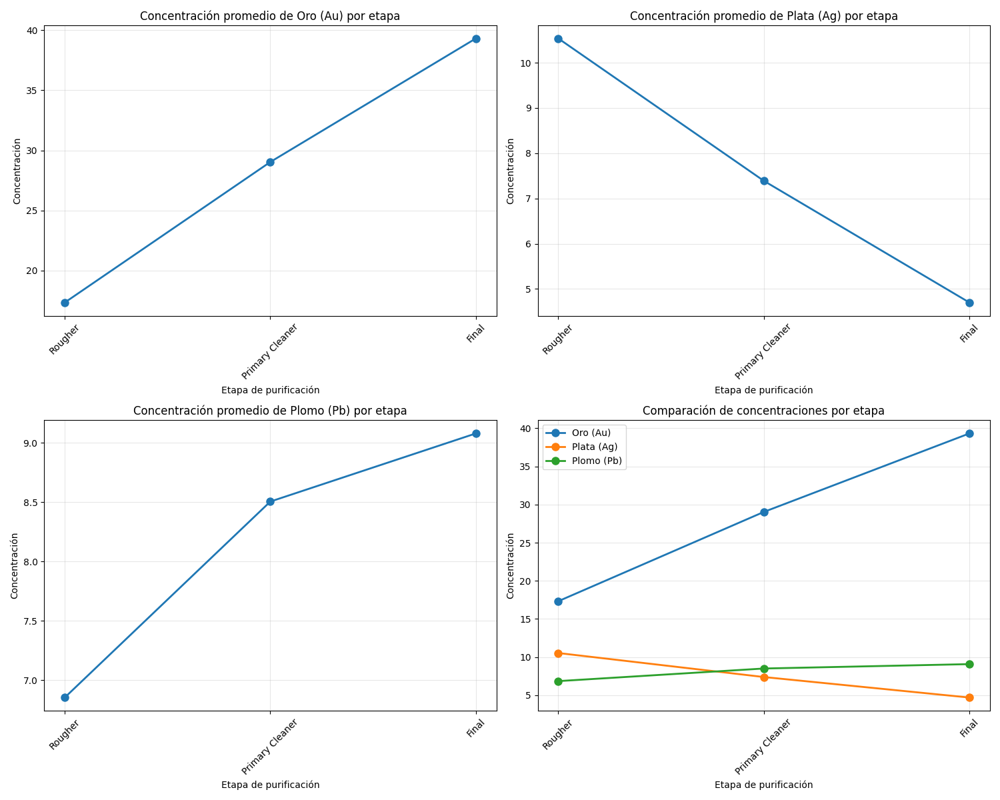
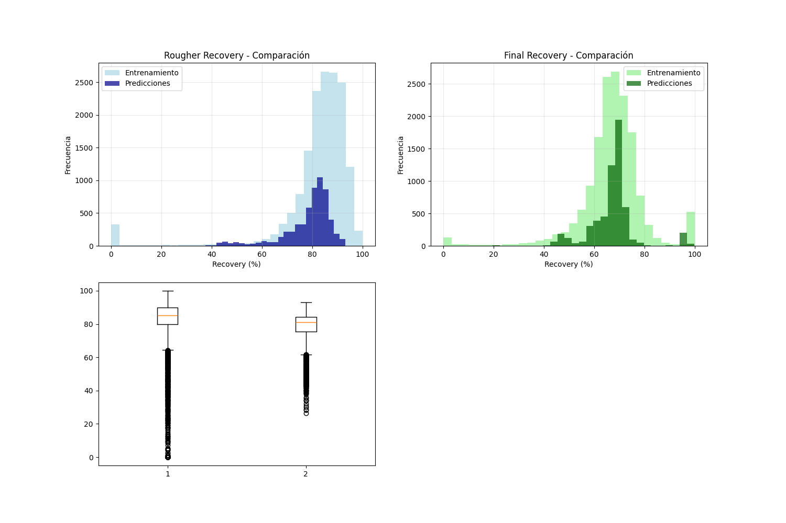
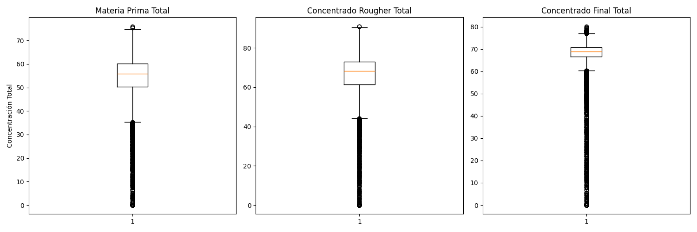
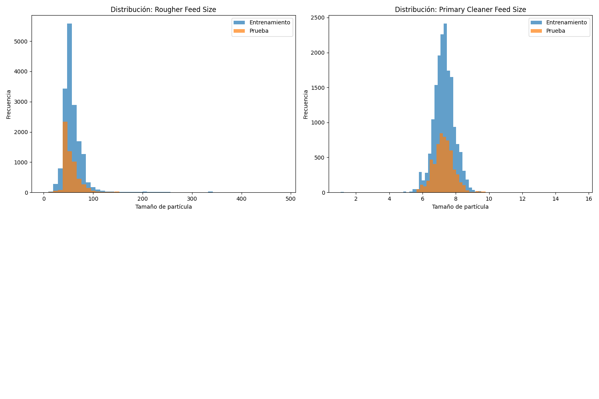
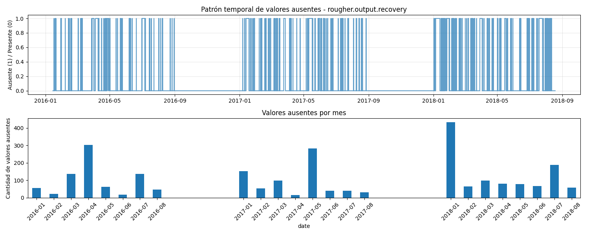

# Gold Recovery Prediction

# Gold Recovery Prediction in Industrial Processes

## Project Overview
This project aims to predict gold recovery rates in an industrial process using machine learning models and advanced data preprocessing.

## Objectives
- Predict rougher and final recovery rates
- Improve operational decision-making
- Handle missing and delayed data features

## Tools & Technologies
- Python (pandas, NumPy, scikit-learn)
- Jupyter Notebook

## Methodology
- Data validation (recovery calculation verification)
- Handling missing values and unavailable features
- Outlier detection and removal
- Exploratory Data Analysis (EDA)
- Model training with cross-validation
- Evaluation using sMAPE

## Key Visualizations

### 

### 

### 

###

###

## Models Used
- Linear Regression (baseline)
- Random Forest (final model)

## Performance
- Final model: Random Forest
- sMAPE: **8.09%**
- Improved performance vs baseline

## Key Findings
- Strong relationship between rougher and final stages
- Recovery depends on multiple variables → complex system
- Linear models are insufficient for capturing system behavior

## Business Impact
- Model can support operational decisions
- Helps detect inefficiencies in the process
- Useful for predicting performance trends

## Limitations
- Should not be the only decision-making tool
- Sensitive to changes in process conditions

## Next Steps
- Incorporate more process variables
- Test advanced models (XGBoost, LightGBM)
- Deploy model for real-time monitoring

pip install -r requirements.txt

